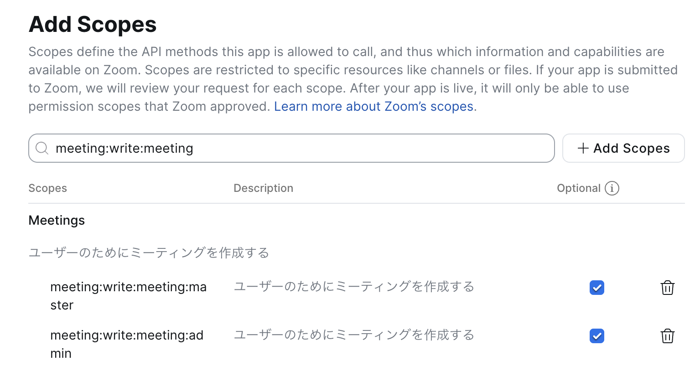

# zoomy — Zoom in your terminal.

[\[日本語\]](README_ja.md)

A CLI tool for managing Zoom resources via Server-to-Server OAuth. JSON output, customizable meeting topics, and script-friendly design.

## Features

- **Meetings** — create, get, update, delete meetings with auto-generated topics, list scheduled meetings with date filters
- **Customizable topics** — template-based topic generation with date formatting and participant names
- **JSON output** — `--json` flag for scripting and automation
- **Server-to-Server OAuth** — no browser login required, token auto-refresh
- **Timezone-aware** — configurable timezone for topic date formatting

## Installation

### npm (global)

```bash
npm install -g github:tackeyy/zoomy
```

### Clone and install

```bash
git clone https://github.com/tackeyy/zoomy.git
cd zoomy
npm install -g .
```

## Quick Start

### 1. Create a Zoom Server-to-Server OAuth App

1. Log in to [Zoom Marketplace](https://marketplace.zoom.us/)
2. **Develop** > **Build App** > **Server-to-Server OAuth** > **Create**
3. Name your app (e.g., `zoomy`)

### 2. Configure Scopes

In the **Scopes** tab, click **+ Add Scopes** and add:

- `meeting:write:meeting` — create/update/delete meetings
- `meeting:read:list_meetings` — list meetings
- `meeting:read:meeting` — get meeting details



### 3. Activate the App

Go to the **Activation** tab and click **Activate your app**.

### 4. Set Up Environment Variables

```bash
cp .env.example .env
```

Edit `.env` with your credentials from the **App Credentials** tab:

```bash
ZOOM_ACCOUNT_ID=your_account_id
ZOOM_CLIENT_ID=your_client_id
ZOOM_CLIENT_SECRET=your_client_secret
```

### 5. Run

```bash
zoomy create --start "2026-02-10T10:00:00" --duration 60 --with "Alice"
```

## Commands

### `create` — Create a meeting

```bash
zoomy create --start <datetime> --duration <minutes> [--with <name>] [--json]
```

| Flag | Required | Description |
|---|---|---|
| `--start <datetime>` | Yes | Start time in ISO 8601 (e.g., `2026-02-10T10:00:00`) |
| `--duration <minutes>` | Yes | Duration in minutes (max 1440) |
| `--with <name>` | No | Participant name (used in topic) |
| `--json` | No | Output as JSON |

Examples:

```bash
# With participant — topic: "2026/02/10 10:00 | Alice"
zoomy create --start "2026-02-10T10:00:00" --duration 60 --with "Alice"

# Without participant — topic: "2026/02/10 10:00"
zoomy create --start "2026-02-10T10:00:00" --duration 30

# JSON output
zoomy create --start "2026-02-10T10:00:00" --duration 60 --with "Alice" --json
```

### `list` — List scheduled meetings

```bash
zoomy list [--from <date>] [--to <date>] [--json]
```

| Flag | Required | Description |
|---|---|---|
| `--from <date>` | No | Start date filter (`YYYY-MM-DD`) |
| `--to <date>` | No | End date filter (`YYYY-MM-DD`) |
| `--json` | No | Output as JSON |

Examples:

```bash
zoomy list
zoomy list --from "2026-02-10" --to "2026-02-14"
zoomy list --json
```

### `get` — Get meeting details

```bash
zoomy get <meetingId> [--json]
```

| Flag | Required | Description |
|---|---|---|
| `<meetingId>` | Yes | Meeting ID |
| `--json` | No | Output as JSON |

Examples:

```bash
zoomy get 12345678901
zoomy get 12345678901 --json
```

### `update` — Update a meeting

```bash
zoomy update <meetingId> [--topic <topic>] [--start <datetime>] [--duration <minutes>] [--json]
```

| Flag | Required | Description |
|---|---|---|
| `<meetingId>` | Yes | Meeting ID |
| `--topic <topic>` | No | New topic |
| `--start <datetime>` | No | New start time (ISO 8601) |
| `--duration <minutes>` | No | New duration in minutes (max 1440) |
| `--json` | No | Output as JSON |

At least one of `--topic`, `--start`, or `--duration` is required.

Examples:

```bash
zoomy update 12345678901 --topic "New Topic"
zoomy update 12345678901 --start "2026-02-15T14:00:00" --duration 90
zoomy update 12345678901 --topic "Updated" --json
```

### `delete` — Delete a meeting

```bash
zoomy delete <meetingId>
```

| Flag | Required | Description |
|---|---|---|
| `<meetingId>` | Yes | Meeting ID |

Examples:

```bash
zoomy delete 12345678901
```

## Configuration

### Environment Variables

| Variable | Default | Description |
|---|---|---|
| `ZOOM_ACCOUNT_ID` | *(required)* | Zoom account ID |
| `ZOOM_CLIENT_ID` | *(required)* | OAuth client ID |
| `ZOOM_CLIENT_SECRET` | *(required)* | OAuth client secret |
| `ZOOM_TIMEZONE` | `Asia/Tokyo` | Timezone for topic date formatting |
| `ZOOM_DATE_FORMAT` | `yyyy/MM/dd HH:mm` | Date format in topics |
| `ZOOM_TOPIC_TEMPLATE` | `{{date}} \| {{with}}` | Topic template when `--with` is specified |
| `ZOOM_TOPIC_TEMPLATE_NO_WITH` | `{{date}}` | Topic template when `--with` is omitted |

## Output Formats

### Text (default)

```
Meeting created!
  Topic:    2026/02/10 10:00 | Alice
  Start:    2026-02-10T10:00:00Z
  Duration: 60 min
  Join URL: https://zoom.us/j/123456789
```

### JSON

```bash
zoomy create --start "2026-02-10T10:00:00" --duration 60 --with "Alice" --json
```

```json
{
  "id": 123456789,
  "topic": "2026/02/10 10:00 | Alice",
  "start_time": "2026-02-10T10:00:00Z",
  "duration": 60,
  "join_url": "https://zoom.us/j/123456789"
}
```

## Contributing

We welcome contributions! Please see our [Contributing Guide](CONTRIBUTING.md) for details on:

- How to report bugs and request features
- Development setup and coding standards
- Testing requirements and guidelines
- Pull request process

## Development

```bash
npm install
npm test
```

Tests use [Vitest](https://vitest.dev/). See [Testing Guide](docs/TESTING.md) for comprehensive testing documentation.

## License

ISC

## Links

- [GitHub Repository](https://github.com/tackeyy/zoomy)
- [Zoom API Documentation](https://developers.zoom.us/docs/api/)
- [Zoom Server-to-Server OAuth](https://developers.zoom.us/docs/internal-apps/s2s-oauth/)
